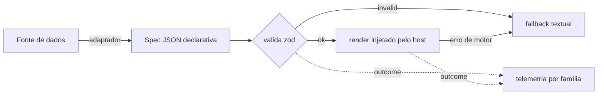

# Biblioteca portátil de gramática visual (OBS-I01) — desenho

> Desenho do pacote-biblioteca que extrai o núcleo da gramática visual do
> `nup-study` para ser reutilizado por `nup-sentinel-manifest` (grafo/painel) e
> por outros hosts. Scaffold inicial em `shared/viz/`. Não altera o `nup-study`.

## 1. Contrato: `spec → valida → render → fallback`



| Etapa | Onde vive | Responsável |
|---|---|---|
| **spec** | portátil (`visual-spec.ts`) | IA (no study) ou adaptador de dados (no sentinel) |
| **valida** | portátil (`validateVisualSpec`, zod) | a biblioteca — puro, nunca lança |
| **render** | **host** (não portátil) | Recharts/ECharts (cliente), SVG (servidor) — injetado |
| **fallback** | portátil (sempre presente) | a biblioteca garante texto mesmo em erro |
| **telemetria** | contrato portátil + transporte do host | `makeQualityEvent` define o evento; host persiste |

Princípio herdado do ADR-013 do study: **dado não verificável não renderiza**;
a spec carrega `source` (proveniência) e o host sempre tem um `fallback`.

## 2. O que é portátil vs. o que fica no host

| Camada | Portátil? | Observação |
|---|---|---|
| Tipos de spec + validadores zod (`chart-spec`, famílias) | ✅ | núcleo framework-agnóstico |
| Taxonomia de famílias + contrato de telemetria | ✅ | eixo de corte do A/B (OBS-I11) |
| Compiladores spec→`option` (ex.: `chart-option-compiler`) | ◐ | portátil em TS puro, mas acoplado ao formato ECharts |
| Componentes React (`AdaptiveChart`, `MathBoard`, `ReviewBoard`…) | ❌ | dependem de React + motor |
| Motores (ECharts, Mermaid, Cytoscape, KaTeX) | ❌ | pesados; o host escolhe e injeta |
| Telemetria via `localStorage` (bucket A/B) | ❌ | específica de navegador; o contrato do evento é portátil |
| Detecção por fence (```chart etc.) | ❌ | acoplada ao formato de chat do study |

## 3. Honestidade sobre a extração (sem quebrar o `nup-study`)

| Item | Veredito | Por quê |
|---|---|---|
| Specs + validadores zod | **Extraível já** | TS puro, só dependem de `zod`; é o que este scaffold faz |
| Família + telemetria (contrato) | **Extraível já** | sem dependência de runtime |
| Compiladores (chart→ECharts option) | **Extraível com esforço médio** | mover `chart-option-compiler` exige publicar como pacote e o study passar a consumi-lo — mudança de build dos DOIS repos |
| Componentes React | **Não extrair agora** | arrastam React + motores; a extração real é um pacote `@nuptechs/visual-grammar` publicado, com o study migrado a consumi-lo — **BLOQUEADO-POR-INFRA** (mexe no build do nup-study) |

**Conclusão:** o núcleo declarativo (spec/valida/fallback/telemetria-contrato) sai
limpo e já está aqui. Os compiladores saem num segundo momento como pacote
versionado. Os componentes de render **não** se extraem sem um monorepo/pacote
publicado e migração do study — fora do escopo mergeável sem infra.

## 4. Scaffold entregue (`shared/viz/`)

| Arquivo | Papel |
|---|---|
| `visual-spec.ts` | contrato: famílias, `chartSpecSchema` (zod), `validateVisualSpec`, evento de telemetria |
| `graph-to-spec.ts` | adaptador de dados: `GraphPayload`/telemetria → `ChartSpec` validada |
| `tests/viz/graph-to-spec.test.ts` | prova pura do contrato e dos adaptadores |

## 5. Próximos passos (fora deste scaffold)

- Completar catálogo de tipos (OBS-I03: heatmap/treemap/sankey/gauge…) nos schemas.
- Publicar `@nuptechs/visual-grammar` e migrar o `nup-study` a consumi-lo (pacote + build — BLOQUEADO-POR-INFRA).
- Ligar `qualityByFamilySpec` a uma fonte real de telemetria do painel (OBS-I11).
